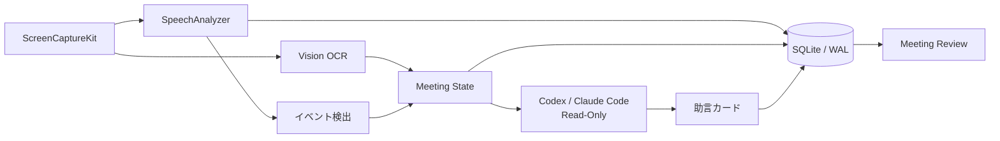

# Cue

[](https://github.com/OOR30/cue/actions/workflows/ci.yml)
[](LICENSE)

Cueは、macOS上の会議をリアルタイムに文字起こしし、プロジェクトの資料やソースコードを参照しながら、質問・要望・決定・TODO・リスクを短い助言カードとして提示するローカルファーストの会議支援アプリです。

## 特徴

- ScreenCaptureKitによるシステム音声・マイク音声・選択画面の取得
- SpeechAnalyzer / SpeechTranscriberによる端末内日本語文字起こし
- Visionによる画面文字の端末内OCR
- 自分とそれ以外の発言を分けたタイムライン
- 質問、要望、決定、TODO、重要情報、リスクのイベント検出
- CodexまたはClaude Codeを利用した読取り専用のFast／Deep分析
- 根拠、確信度、重要度を持つ助言カード
- プロジェクト資料、ソースコード、Git履歴、過去会議の参照
- SQLite/WALへの会議・文字起こし・状態・助言のローカル保存
- Meeting Review、全文検索、Markdown書き出し
- メニューバー、右側パネル、変更可能なグローバルショートカット
- 診断レポートと長時間品質ゲート

画面画像と生音声は現在保存しません。OCRで抽出した画面コンテキストと、文字起こし・構造化情報だけを保存します。詳しくは[プライバシー方針](PRIVACY.md)を参照してください。

## アーキテクチャ



`CueCore`にモデル・検出・永続化を、`CueApp`にmacOS UI・キャプチャ・文字起こし・AI接続を分離しています。

## 動作環境

- macOS 26以降
- Xcode 26.6以降
- Swift 6.3以降
- Codex CLI 0.147.0互換、またはClaude Code

## ビルド

```sh
swift test
./scripts/build-app.sh
open build/Cue.app
```

`build-app.sh`はHardened Runtimeを有効にし、既定ではad-hoc署名します。Developer IDで署名する場合は次のように指定します。

```sh
CODE_SIGN_IDENTITY="Developer ID Application: ..." ./scripts/build-app.sh
```

公証にはApple Developerの証明書と、`notarytool store-credentials`で作成したKeychain Profileが必要です。

```sh
CODE_SIGN_IDENTITY="Developer ID Application: ..." \
NOTARYTOOL_PROFILE="cue-notary" \
./scripts/package-and-notarize.sh
```

## 初回起動

1. 画面収録とマイクを許可します。
2. Project Rootを登録します。
3. 「会議を開始」を押します。
4. macOSの共有ピッカーで会議アプリ、ウインドウ、またはディスプレイを選択します。

Zoom検知は自動録音を開始しません。検知後に利用者が「開始」を選んだ場合だけ、権限確認と共有対象の選択へ進みます。

## データ保存先

```text
~/Library/Application Support/Cue/
├── cue.sqlite
└── CodexSafeHome/
```

旧名称の保存先が存在する場合、Cueは初回起動時にSQLiteのオンラインバックアップAPIを使って履歴を移行します。旧データは自動削除しません。

## セキュリティ

- AI Providerは読取り専用sandboxと承認拒否で起動します。
- Project Rootと許可した追加参照先の外側は根拠として採用しません。
- Backlog APIキーはSQLiteへ保存せず、端末限定のKeychainへ保存します。
- 生音声、画面画像、ローカルDB、認証情報はGit管理対象外です。

脆弱性の報告方法は[SECURITY.md](SECURITY.md)を参照してください。

## ロードマップ

一時停止・再開、入力デバイス選択、会議一覧とアーカイブ、AI会議要約、参加者マスター、話者分離・声紋照合、Zoom RTMS連携を順次進めます。詳細は[ROADMAP.md](ROADMAP.md)にまとめています。

## 設計資料

- [技術調査・アーキテクチャ提案](docs/cue-architecture-proposal.md)
- [開発指示書](docs/cue-development-instructions.md)
- [Phase 1品質ゲート](docs/phase1-quality-gate-report.md)
- [Phase 2優先順位](docs/phase2-competitive-review-and-priorities.md)

## ライセンス

[MIT License](LICENSE)
